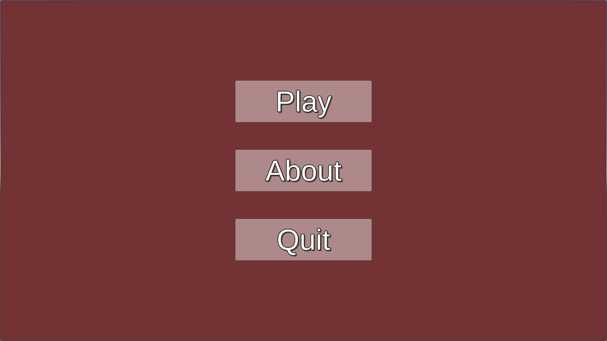
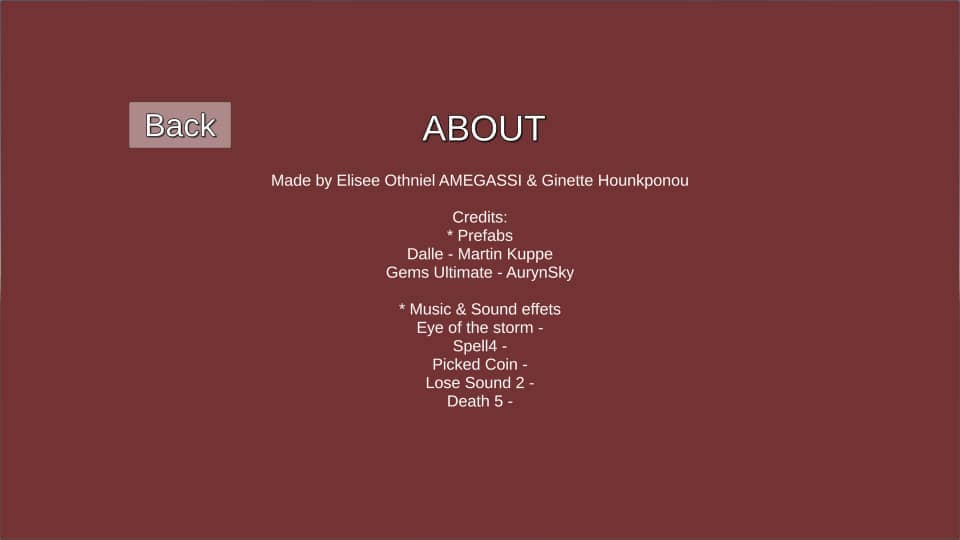
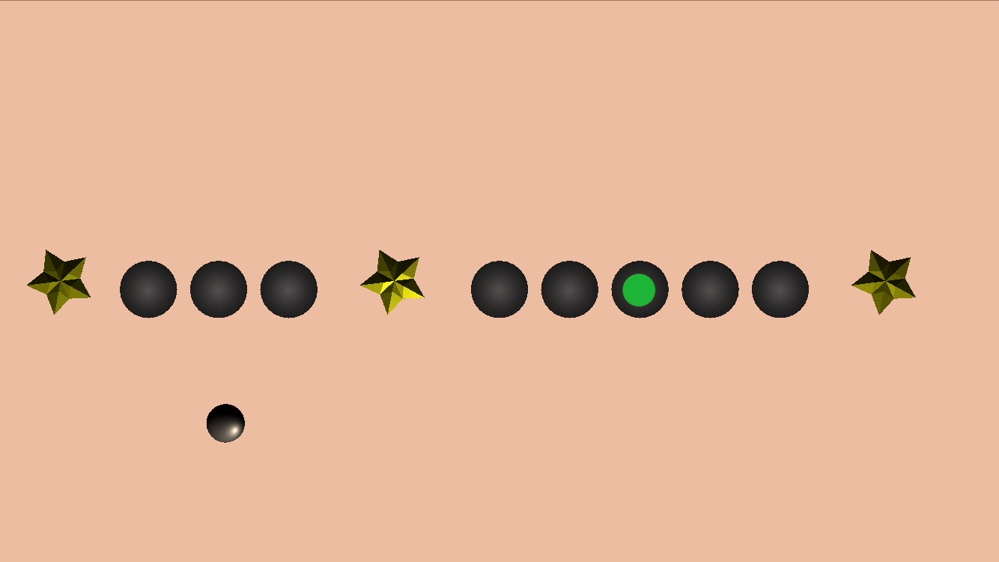
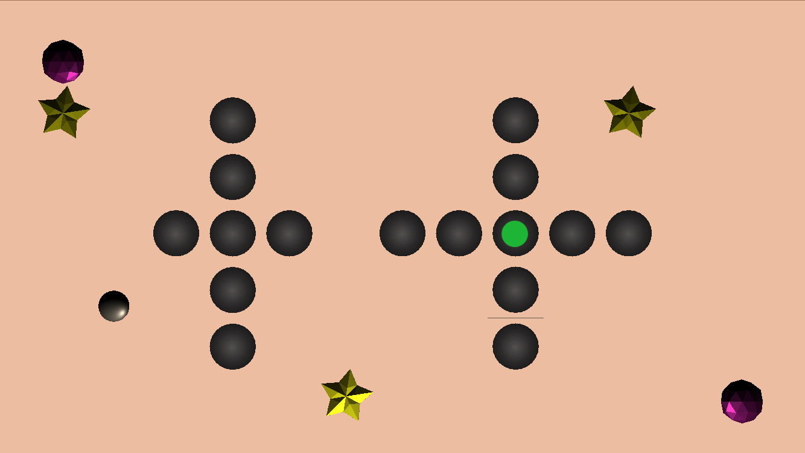
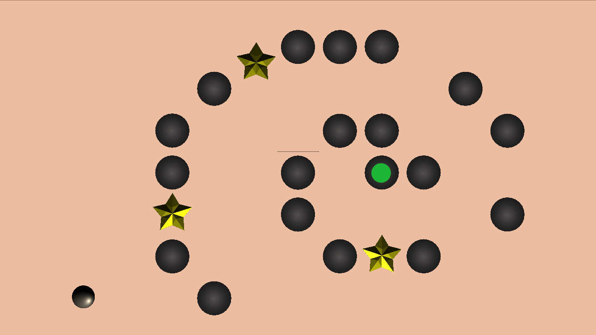
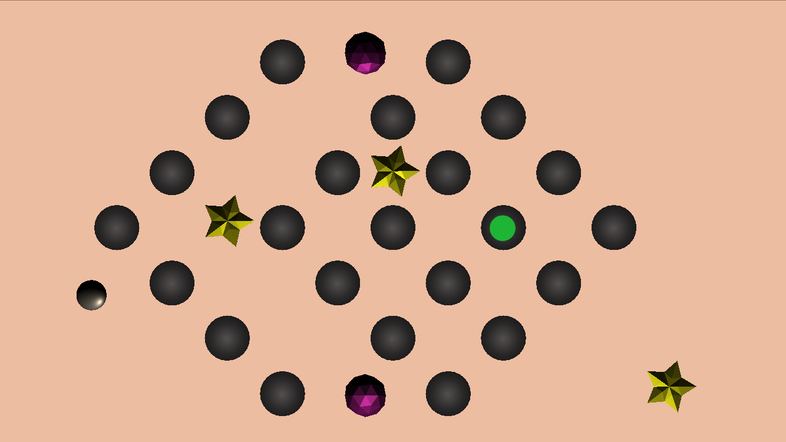
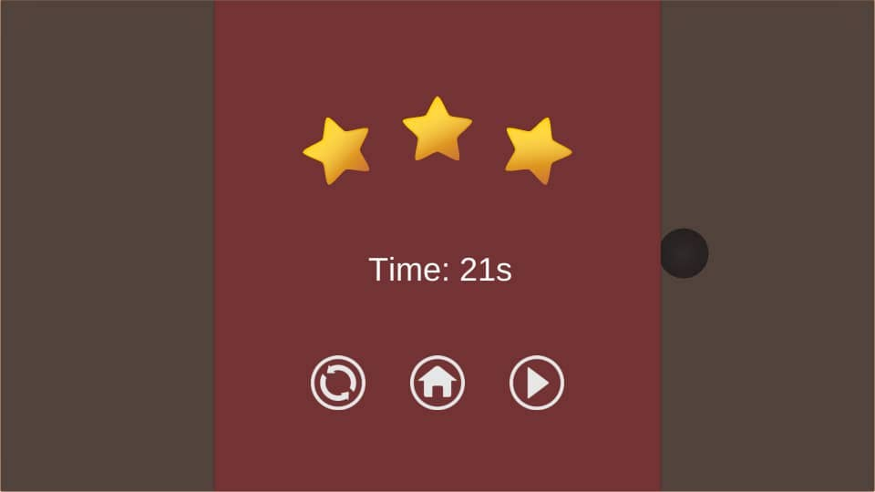
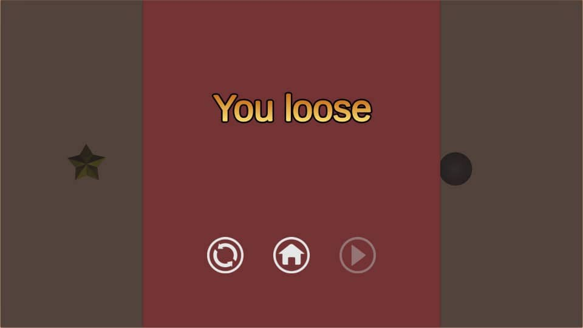
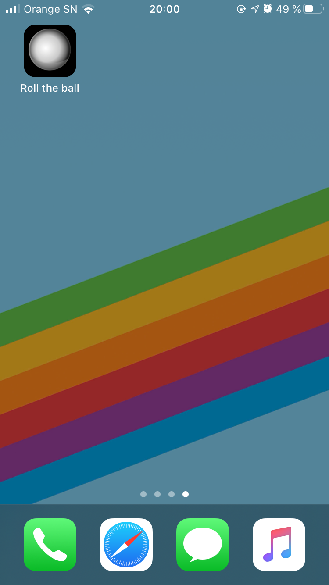
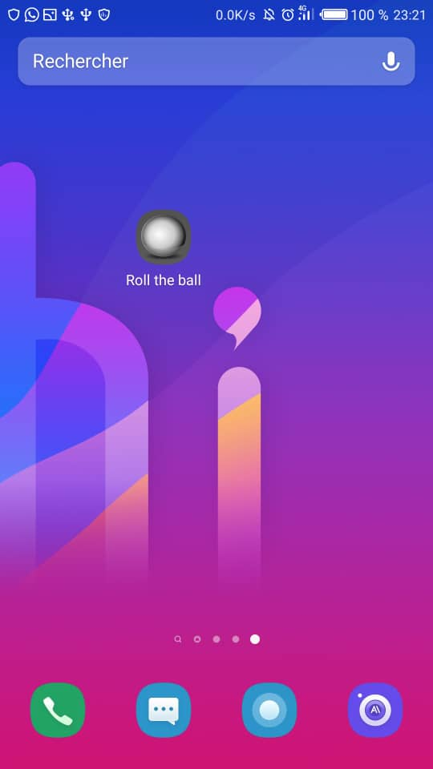

# Roll the Ball

## 1) Description
Roll the Ball is a mobile casual game whose objective is to roll a ball until you reach a goal while avoiding trap holes and collecting bonuses.

## 2) Technical environment
:video_game: Game Engine : Unity 2019.1.10f1  
:memo: Editor : Visual Studio 2019  
:art: Textures : GIMP  
:package: Assets : [Open Game Art](https://opengameart.org/), [Unity Asset Store](https://assetstore.unity.com/)  

## 3) Features
- [x] 10 levels
- [x] Musical theme and sound effects
- [x] Main menu (play, about, quit)
- [x] Game menu (pause, next level, restart level)
- [x] Bonus
- [x] Animations
- [x] Score (elapsed time, number of stars)

## 4) Outlook
- [ ] Add simpler levels
- [ ] Improve the plateau
- [ ] Allow the player to select a level from a menu
- [ ] Calculate a score based on time and bonuses collected
- [ ] Add an additional bonus which is worth a lot of points but
which reduces the field of vision of the camera to challenge the player.

## 5) Screenshot
<table border="0px">
    <tr>
        <td>
            
        </td> 
        <td>
            
        </td>
    </tr>
    <tr>
        <td>
            
        </td> 
        <td>
            
        </td>
    </tr>
     <tr>
        <td>
            
        </td> 
        <td>
            
        </td>
    </tr>
    <tr>
        <td>
            
        </td> 
        <td>
            
        </td>
    </tr>
    <tr>
        <td>
            
        </td> 
        <td>
            
        </td>
    </tr>
</table>